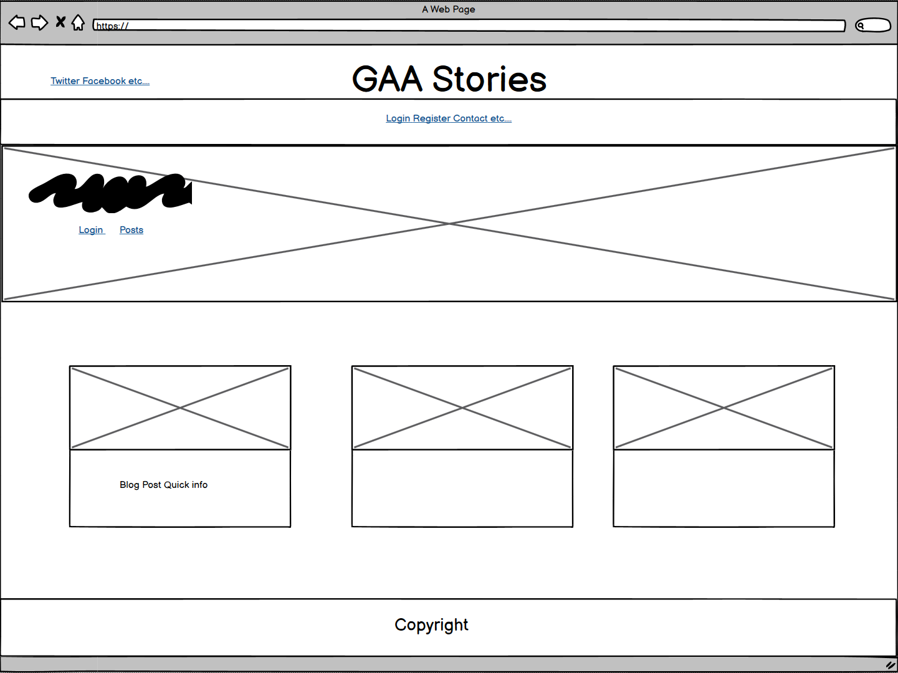

# Welcome to **[GAA Stories](https://p4-gaa-stories.herokuapp.com/)**


The purpose of this blog page is for people who are interested in talking and hearing about all the latest news within the GAA. Users can interact with posts by liking or commenting on a post they're interested in (only registered users can do these actions). Registered users can also create their own posts for the community to see.

Check the deployed page [here](https://p4-gaa-stories.herokuapp.com/).

***

## User Experience (UX)

First Time User Goals

* As a First Visit User, I understand the purpose of the blog straight away.
* As a First Visit User, I find it easy to navigate the website.
* As a First Visit User, I can register for an account.
* As a First Visit User, I can read all the blog posts.
* As a First Visit User, I can contact the site owner.

Registered User Goals

* As a Registered User, I can log in to my account so that I can start liking and commenting on posts.
* As a Registered User, I can log out of my account for security reasons.
* As a Registered User, I can modify and update my posts.
* As a Registered User, I can delete my posts if necessary.

Admin User Goals

* As an Admin, I can create, read, update and delete posts from the admin panel.
* As an Admin, I can approve or disapprove any comments.
* As an Admin, I can approve all new blog posts, so that I can make sure the post is appropriate.
* As an Admin, I can determine the specific level of privilege of users to post blogs.

GitHub issues were used to record the user stories. I then created a project to store them in and moved them from 'Todo -> 'In Progress' ->  'Done' as I was implementing each user story into the website. I found this a very helpful way to see all user stories in one place and tick them off one by one.


***

## Design 

### Wireframe
The first thing I drew up was a very rough wireframe to get a feel for the base layout. I didn't want to do much with the wireframe as I wanted to see what felt right as I went on with the project. 

<details>
<summary>Wireframe</summary>


</details>

### Colour Palette

The colour palette I used was generated from a picture of Croke park which is the header image on the home page. The colours generated can be seen below.

<details>
<summary>Color Palette</summary>


</details>

### Fonts

The fonts I used for this project are 'Oxygen' for the body and 'Prompt' for the page title.


### Database Schema
To create the back-end database I have used ElephantSQL. I have designed my database using [drawSQL](https://drawsql.app/), this is a free-to-use software however quite limited, as some fields didn’t allow me to overwrite them, such as image fields. To help with the authentication Django has a built-in user model which helps save time creating my model.

I have created three models for this project Post Model, Comment Model and the Contact Us Model.

<details>
<summary>Models Diagram</summary>


</details>

***


## Features

### Home Page
When you enter the site for the first time you are greeted with a header image of the home of the GAA (Croke Park). Within the image, there is some text to give a first time user a clear view of what the blog is about. 


### Navbar
There is a very clear navbar which sticks to the top of the page so is always available for use. The navbar changes depending on whether the user has logged in or not. If not logged in a user will have the option to register(if they don't already have an account) or to log in. If the user has logged in then they can add a post direct from the navbar or log out of their account.


### Contact Us
The contact us page is a simple form for the user to fill out. When the user completes it, it will be sent to the admin panel for the site owner to see.


### Blog 
On this page, the user can see 6 posts per page with the most recent blog posts showing up first. The user can then click any post they wish to view which will bring them to view the full post.


### Blog post full view
When the user clicks into a post they will see the title, author and date/time it was posted. Then they will see the full content of the post and also how many likes and comments the post has. However, if the user is not logged in they cannot like or view comments on the post.

<br>

If the user is logged in they will be able to like the post and comment on it. Also if the post is one of the currently logged in users then they will have the functionality to edit or delete the current post.

<br>

This is the comment section the user will see if logged in. They have the ability to create their own comment and can also see all the previous comments along with who wrote them and the date they wrote them.


### Create a post
When the user wishes to create their own blog post they will be directed to this page which is a form for them to fill out with all the information they would like to include in their post. Once they click add, it will have to be reviewed by the site owner before it will be visible for everyone to see.


### Sign Up
This page allows the user to sign up for their own personal account. They must create their own username and password. Once the form is completed they will be redirected back to the home page where they can start interacting with blog posts. If a user already has an account they can click the "sign in" link in the line of text.


### Sign In
When a user has an account this is the page they can log in from. They simply have to input their username and password. If a user doesn't already have an account they can click the "sign up" link in the line of text to sign up for an account first.


### Sign Out
When a user clicks the logout button they will be redirected to this page to confirm that they want to log out.


### Edit Post
When the author of the post clicks the edit button they will be met with the same form as when they added the post except for this time all the fields will be prepopulated with the information that was filled in already making it very easy for the user to edit the post.


### Delete Post
When a user wishes to delete a post and they hit the "Delete Post" button they will be directed to this page to confirm that they wanna delete the selected post.


***

## Tech Stack 

### Languages
The main programming languages used are:

- Python
- HTML
- CSS
- Javascript
- Django

### Tools
- [Github](https://github.com/) for storing and version control of the code.
- [Gitpod](https://gitpod.io/workspaces) for editing code.
- [Heroku](https://heroku.com/) for deployment.
- [Cloudinary](https://cloudinary.com) for storing the images and CSS files used in this project.
- [Bootstrap](https://getbootstrap.com/) was used to speed up the design, style and responsiveness of the website.
- [Google](https://www.google.ie/) was used to source the images for the page.
- [Font Awesome](https://fontawesome.com/) was used for the like button and the comment icon.
- [Google Fonts](https://fonts.google.com/) was used to get the fonts used in the project. 
- [Coolors](https://coolors.co/) was used to generate a colour palette from an image I used.

***

## Testing

Testing was done throughout the development of this site through trial and error with Google Dev tools. Testing and code validation can be found in the following [TESTING.md](TESTING.md).

***

## Deployment
 
To deploy your own project through Heroku follow the below steps:

* Sign Up/ Log In to Heroku
* On the Dashboard page select 'New' and the 'Create New App'.
* Provide your new app with a suitable name which is unique as it can't be in use already, and select the region.


* I used [ElephantSql](https://www.elephantsql.com/) for my database.
* Create your ElephantSql account.
* Then navigate to the 'Create New Instance' tab.
* Name your database and select 'Tiny Turtle' in the 'plan' dropdown as it is the free option.
* Hit the 'Select region' button to continue.
* From the 'Data center' dropdown select the option which is closest to your region.
* Hit the 'review' button to review your plan and if it is all good then hit 'create instance' to create your database.


* Within the repository in GitPod create a new file called env.py - within this file import the os library and set the environment variable for the DATABASE_URL ElephantSQL.
* Add a secret key to the app using os.environ["SECRET_KEY"] = "your secret key goes here". Add the secret key just created to the Heroku Config Vars as SECRET_KEY as the key and "your secret key" as the value.
* In the settings.py file within the Django app, import Path from pathlib, import os and import dj_database_url insert the line if os.path.isfile("env.py"): import env remove the insecure secret key with SECRET_KEY = os.environ.get('SECRET_KEY') replace the databases section with DATABASES = { 'default': dj_database_url.parse(os.environ.get("DATABASE_URL"))}.
* In the terminal migrate the models over to the new database and sign up/log in to cloudinary.
* In cloudinary copy the CLOUDINARY_URL to the clipboard and paste this into the env.py as follows: os.environ["CLOUDINARY_URL"] = "Url copied here".
* In Heroku, add the CLOUDINARY_URL and value copied from the clipboard to the config vars in settings. Also, add the KEY - DISABLE_COLLECTSTATIC with the Value - "1". (This must be removed before final deployment)
* Add the cloudinary libraries to the list of installed apps just above above 'django.contrib.staitcfiles' and cloudinary goes below.
* In the Settings.py file - add the STATIC files settings - the url, storage path, directory path, root path, media url and default file storage path.
* Change the templates directory to TEMPLATES_DIR - 'DIRS': [TEMPLATES_DIR]
* Heroku needs to be added to the allowed_hosts list followed by 'localhost'.
* Create a new file on the top level directory - Procfile. Within this file ensure the following code is added: web: guincorn PROJECT_NAME.wsgi
* Ensure ALL changes have been added, committed and pushed to GitHub.
* Return to Heroku and look for the deployment tab. Click Deploy branch manually (this can be changed to automatic at later date).
* If there are no build log errors you should see a notification advising ' Your App was successfully deployed' with a link to the live site.

```
Go to "Settings" then "Config Vars" and click the button "Reveal Config Vars". 
Make sure your Config Vars look as follows:

    * DATABASE_URL - (will be copied from ElephantSql)
    * SECRET_KEY - (this is whatever value you gave it in settings.py)
    * CLOUDINARY_URL - (copy the URL from your account on Cloudinary) 
    * DISABLE_COLLECTSTATIC - (1)
    * PORT - (8000)
```

***

## Credits

- The initial site functionality was made using the 'I Think There For I Blog' walkthrough by Matt Rudge via Code Institute. The code was adapted to what I needed.

- The [Django Documentation](https://docs.djangoproject.com/en/4.1/) was an invaluable source of information throughout this project

- The [Bootstrap Documentation](https://getbootstrap.com/docs/5.0/getting-started/introduction/) was a big source of information when the styling of the website was created.

- This [video series](https://www.youtube.com/watch?v=B40bteAMM_M&list=PLCC34OHNcOtr025c1kHSPrnP18YPB-NFi) helped me alot throughout the project.

- Online resources such as:
    - [W3School](https://www.w3schools.com/)
    - [Fontawsome](https://fontawesome.com/)
    - [Markdown best practices](https://www.markdownguide.org/basic-syntax/)
    - [Stackoverflow](https://stackoverflow.com/)

- The Code Institute Slack channel for always being helpful and full of information.
