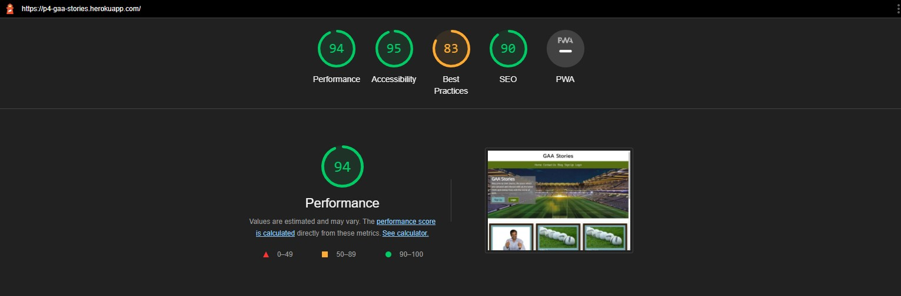

## Manual Testing

### Home Page/Navigation/Footer
| Test                                     | Testing Performed                           | Expected Outcome                                                                                                              | Pass/Fail |
|------------------------------------------|---------------------------------------------|-------------------------------------------------------------------------------------------------------------------------------|-----------|
| Header Text                              | Click "GAAStories" text                  | Takes the user to the home page.                                                                                              | Pass      |
| Navbar Log in                            | Click link                                  | Takes the user to the Log In page.                                                                                            | Pass      |
| Navbar Sign Up                           | Click link                                  | Takes the user to the Sign Up page.                                                                                           | Pass      |
| Navbar Logout (when user is logged in)   | Click link                                  | Redirect user to Log Out page to confirm Log Out                                                                              | Pass      |
| Blog Link                    | Click the link                               | Redirects user to all blog posts.                                                                                          | Pass      |
| Navbar small/medium screens              | Click hamburger icon                        | The Log In, Sign Up, Logout, Blog and Add Post elements are available and work the same way as on large screens. | Pass      |
| Social Media Links/buttons               | Click social media links/buttons            | Redirects user to the social media accounts.                                                                                       | Pass      |
| Click the title of a blog post               | Click blog post title            | Redirects user to the full version of the blog post.                                                                                       | Pass      |
### Blog Post Detailed Page
| Test                     | Testing Performed                                         | Expected Outcome                                  | Pass/Fail |
|--------------------------|-----------------------------------------------------------|---------------------------------------------------|-----------|
| Edit Post                | Click on the edit button (as long as your the person that created the post)                                      | Takes the user to a page to make changes to the current post                    | Pass      |
| Delete Post                | Click on the delete button (as long as your the person that created the post)                                       | Double checks to confirm the user wants to delete the post.                    | Pass      |
| Like Post                | Click on like button                                      | Adds a like to the chosen post                    | Pass      |
| Unlike Post              | Click on like button(when post is already liked)        | Deletes the like from the chosen post             | Pass      |
| Comment Form add comment | Enter text in to comment form and click submit            | Alert message "Your Comment is awaiting approval" | Pass      |
| Comment added | Added a comment            | Number of comments increases by one beside the speech bubble icon. | Pass      |
| Comment Form Empty       | Leave comment form empty and click submit                 | "Please fill out this field" message                | Pass      |
### Sign Up Page
| Test                    | Testing Performed           | Expected Outcome                                                                                                                                                 | Pass/Fail |
|-------------------------|-----------------------------|------------------------------------------------------------------------------------------------------------------------------------------------------------------|-----------|
| Sign Up form works      | Enter username/password     | The Django registration form is validating automatically if the username is valid and if the passwords match and are valid. Otherwise an error message is shown. | Pass      |
| Log In Link             | Click                       | Takes the user to the Log In page.                                                                                                                               | Pass      |
| Successful registration | Finish registration process | Success alert message appears. User is logged in automatically and redirected to home page.                                                                      | Pass      |
### Log In Page
| Test             | Testing Performed    | Expected Outcome                                                                                                          | Pass/Fail |
|------------------|----------------------|---------------------------------------------------------------------------------------------------------------------------|-----------|
| Log In           | Add credentials      | Django login form checks automatically that username and password match (and exist in DB). Otherwise shows error message. | Pass      |
| Sign Up link     | click                | Takes the user to the Sign Up page.                                                                                       | Pass      |
| Successful login | Finish login process | User is logged in and redirected to home page. Success alert messages appears.                                            | Pass      |
### Log Out Page
| Test           | Testing Performed | Expected Outcome                                                      | Pass/Fail |
|----------------|-------------------|-----------------------------------------------------------------------|-----------|
| Log Out button | Click             | Double checks with the user that they want to log out. | Pass      |

## Automated testing
Due to time constraints I unfortunately did not manage to add any automated test. I plan to do that in the future.

## CSS Validation

I ran my code through [The W3C CSS Validation Service](Jigsaw.w3.org/css-validator) with it showing no errors.

## HTML Validation

I ran my code through [The W3C Markup Validation Service](https://validator.w3.org/) with it showing no errors.

## Python Validation

I ran my code through [CI Python Linter](https://pep8ci.herokuapp.com/) with it showing only a few errors for having a "line too long". You can see all the images below for full context.

Python Validation

## Lighthouse
Overall score came back pretty good apart from best practices which will be worked on in the future.

## Unsolved Bugs

As with all projects I ran into many small problems from something simple like rendering the page to 100% viewport height(which I fixed), to a users uploaded image not showing on the blog page and still only having the placeholder image showing. Unfortunately I could not get this function of the project working in the time scale I had. 
